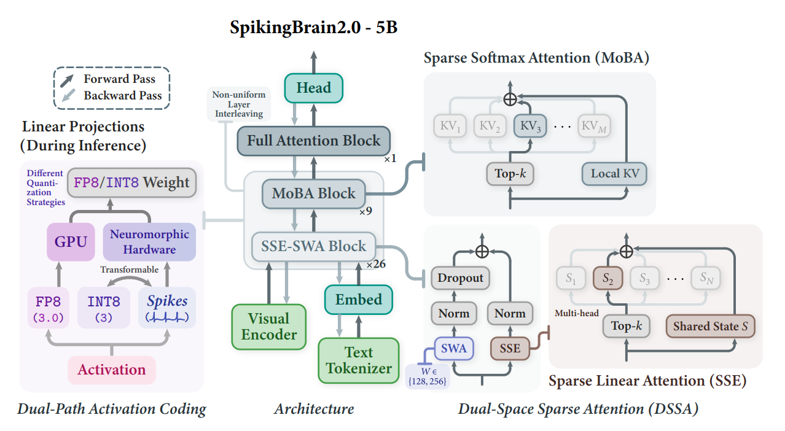

# SpikingBrain2.0：Spiking Brain-inspired Large Models

📄 Technical Report: [English](SpikingBrain_Report_Eng.pdf)  
🚀 Arxiv: [arXiv:2509.05276](https://www.arxiv.org/abs/2509.05276)  
🧩 Models: [Available Models](#available-models)      

---

## About SpikingBrain2.0

SpikingBrain2.0 is a brain-inspired hybrid foundation model family for long-context language and vision-language modeling.

Building on [SpikingBrain1.0](https://github.com/BICLab/SpikingBrain-7B), this repository includes both **SpikingBrain2.0** for language modeling and **SpikingBrain2.0-VL** for vision-language modeling. SpikingBrain2.0 adopts an inter-layer hybrid architecture that combines **Sparse Softmax Attention** ([MoBA](https://github.com/MoonshotAI/MoBA)) with **Sparse Linear Attention** ([SSE](https://openreview.net/pdf?id=R6DrJ4tnGV)), aiming to better balance modeling capability and computational efficiency while alleviating contextual memory interference in long sequences.

To support efficient architecture migration, SpikingBrain2.0 is further built upon a lightweight Transformer-to-Hybrid conversion pipeline, enabling both LLMs and VLMs to be adapted from open-source Transformer backbones at very low cost. With fewer than **7k A100 GPU hours**, it recovers most of the backbone model’s capabilities and achieves competitive performance across general, reasoning, and multimodal benchmarks.




## Repository Structure

```text
SpikingBrain2.0/
├── spb2/                        # Hugging Face implementation of SpikingBrain2.0 LLM
├── spb2vl/                      # Hugging Face implementation of SpikingBrain2.0-VL
├── spb2_vllm/                   # vLLM inference plugin adapted for both SpikingBrain2.0 LLM and SpikingBrain2.0-VL
├── flash-linear-attention_dev/  # Customized flash-linear-attention with SSE support
├── MoBA/                        # Customized MoBA adapted to the newer FlashAttention interface for Hugging Face
└── README.md
```

## Dependency Notes

This repository includes two important local dependency trees.


`flash-linear-attention_dev/` contains a modified version of flash-linear-attention with added SSE support.

In SpikingBrain2.0, [SSE](https://openreview.net/pdf?id=R6DrJ4tnGV) is built as a **Sparse State Expansion** mechanism over [Gated DeltaNet](https://openreview.net/pdf?id=r8H7xhYPwz). By extending the compressed recurrent memory of Gated DeltaNet into multiple sparsely updated state partitions, SSE improves effective memory capacity and long-context retrieval while largely preserving the efficiency benefits of recurrent linear modeling.

---

`MoBA/` contains a customized MoBA implementation whose interfaces were adapted to the newer FlashAttention API used by this repository.This bundled `MoBA/` directory is intended for the **Hugging Face side** of the repository.For the **vLLM side**, `spb2_vllm` does **not** use the bundled `MoBA/`. Instead, it depends on the official **`flash-moba`** package.

Official repository:

- `https://github.com/mit-han-lab/flash-moba`


## Environment Setup

It is recommended to create separate environments for different components if needed.

### Hugging Face LLM (spb2)

#### Setup suggestion

```text
transformers==4.57.1
triton==3.2.0
flash-attn==2.7.3
flash-linear-attention_dev  # use the local version in this repo
MoBA                        # use the local version in this repo
```

### Hugging Face VLM (spb2)

#### Setup suggestion

```text
transformers==4.57.3
flash_attn==2.6.3
flash-linear-attention_dev  # use the local version in this repo
MoBA                        # use the local version in this repo
```

### vLLM inference plugin (spb2_vllm)

#### Setup suggestion

```text
torch>=2.10.0
transformers>=4.57.0
triton==3.6.0
flash_attn==2.8.3
vllm==0.17.1
flash_moba==2.0.0
setuptools
scipy
flash-linear-attention_dev  # use the local version in this repo
```

#### vLLM Usage

After installing the plugin and required dependencies, you can launch SpikingBrain2.0 with vLLM.

```bash
vllm serve <your_model_path> \
  --served-model-name <model_name> \
  --max-model-len 524288 \
  --no-enable-chunked-prefill \
  --no-enable-prefix-caching \
  --gpu-memory-utilization 0.6 \
  --tensor-parallel-size 8 \
  --block-size 128 \
  --dtype bfloat16 \
  --trust-remote-code \
  --port 8000 \
  --compilation-config '{"cudagraph_mode": "FULL_DECODE_ONLY"}'
```

#### Configuration Note for vLLM

Please remove the `auto_map` field from `config.json` before launching with vLLM.

Delete the following block if it is present:

```json
"auto_map": {
  "AutoConfig": "configuration_sse_swa_moba.SSESWAMoBAConfig",
  "AutoModelForCausalLM": "modeling_sse_swa_moba.SSESWAMoBAForCausalLM"
}
```

## Available Models

Model weights are hosted on **ModelScope**:

- [SpikingBrain-2.0-base-8k](https://www.modelscope.cn/models/Panyuqi/SpikingBrain-2.0-base-8k)
- [SpikingBrain-2.0-base-64k](https://www.modelscope.cn/models/Panyuqi/SpikingBrain-2.0-base-64k)
- [SpikingBrain-2.0-base-256k](https://www.modelscope.cn/models/Panyuqi/SpikingBrain-2.0-base-256k)
- [SpikingBrain-2.0-base-512k](https://www.modelscope.cn/models/Panyuqi/SpikingBrain-2.0-base-512k)
- [SpikingBrain-2.0-instruct](https://www.modelscope.cn/models/Panyuqi/SpikingBrain-2.0-instruct)
- [SpikingBrain-2.0-think](https://www.modelscope.cn/models/Panyuqi/SpikingBrain-2.0-think)
- [SpikingBrain-2.0-VL](https://www.modelscope.cn/models/zhongfangzhi/SpikeBrain-2.0-VL)


## Citation

If you find our work useful, please consider citing SpikingBrain2.0:

```bibtex
@article{pan2026spikingbrain2.0,
  title={SpikingBrain2.0},
  author={},
  journal={arXiv preprint arXiv:},
  year={2026}
}

```

