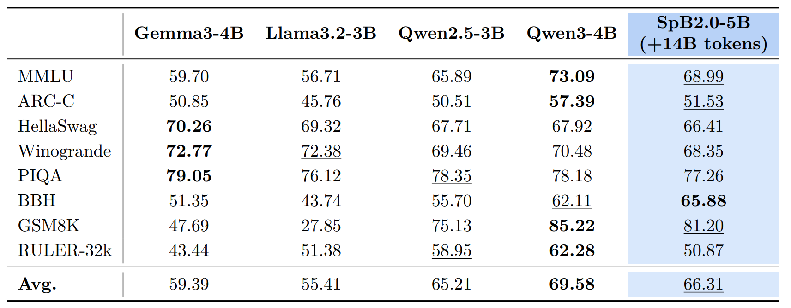

# SpikingBrain2.0：Brain-Inspired Foundation Models 
**Efficient Long-Context and Cross-Platform Inference**

📄 Arxiv: [arXiv](https://www.arxiv.org/abs/)  
🤖 Models: [Available Models](#available-models)      

---

## About SpikingBrain2.0


SpikingBrain2.0 (SpB2.0) is a brain-inspired hybrid model family for efficient long-context language modeling(SpB2.0-5B) and vision-language modeling(SpB2.0-VL-5B). Building on [SpikingBrain1.0](https://github.com/BICLab/SpikingBrain-7B), SpB2.0 introduces **Dual-Space Sparse Attention (DSSA)**, an inter-layer hybrid architecture that combines Sparse Softmax Attention ([MoBA](https://arxiv.org/abs/2502.13189)) with Sparse Linear Attention ([SSE](https://arxiv.org/abs/2507.16577)). This sparse-memory design improves the performance-efficiency trade-off for long-context modeling while reducing memory usage and alleviating contextual interference in long sequences.

SpB2.0 further provides an optimized **Transformer-to-Hybrid (T2H)** conversion pipeline with dual conversion paths for both LLMs and VLMs. Starting from open-source Qwen3 backbones, SpB2.0-5B and SpB2.0-VL-5B recover most of the capabilities of their base Transformer models with fewer than 7k A100 GPU hours of additional training, achieving competitive performance across general, reasoning, long-context, and vision-language benchmarks.

Beyond capability recovery, SpB2.0 offers substantial deployment advantages. Under sequence parallelism, it achieves up to **10.13× TTFT speedup** at 4M context length; under vLLM, it supports serving beyond **10M tokens on 8 A100 GPUs**, where the full-attention baseline exceeds memory limits. SpB2.0 also supports two quantization paths: **FP8** inference for practical acceleration on modern GPUs, reaching **2.52× speedup** at 250k context length, and **INT8-Spiking** coding for sparse event-driven execution on neuromorphic hardware. The INT8-Spiking path achieves **64.31% spike-sequence sparsity** with minimal accuracy loss, while hardware simulation shows **70.6% area reduction** and **46.5% power reduction** at 500MHz.


## Repository Structure

```text
SpikingBrain2.0/
├── spb2/                        # Hugging Face implementation of SpikingBrain2.0 LLM
├── spb2vl/                      # Hugging Face implementation of SpikingBrain2.0-VL
├── spb2_vllm/                   # vLLM inference plugin adapted for both SpikingBrain2.0 LLM and SpikingBrain2.0-VL
├── flash-linear-attention_dev/  # Customized flash-linear-attention with SSE support
├── MoBA/                        # Customized MoBA adapted to the newer FlashAttention interface for Hugging Face
├── run_model/                   # Example scripts for running models with the released checkpoints
└── README.md
```

## Dependency Notes

This repository includes two important local dependency trees.


`flash-linear-attention_dev/` contains a modified version of flash-linear-attention with added SSE support.

In SpikingBrain2.0, [SSE](https://arxiv.org/abs/2507.16577) is built as a **Sparse State Expansion** mechanism over [Gated DeltaNet](https://arxiv.org/abs/2412.06464). By extending the compressed recurrent memory of Gated DeltaNet into multiple sparsely updated state partitions, SSE improves effective memory capacity and long-context retrieval while largely preserving the efficiency benefits of recurrent linear modeling.

---

`MoBA/` contains a customized [MoBA](https://github.com/MoonshotAI/MoBA) implementation whose interfaces were adapted to the newer FlashAttention API used by this repository. This bundled `MoBA/` directory is intended for the **Hugging Face side** of the repository. For the **vLLM side**, `spb2_vllm` does **not** use the bundled `MoBA/`. Instead, it depends on the official **`flash-moba`** package.

Official repository:

- `https://github.com/mit-han-lab/flash-moba`


## Environment Setup

It is recommended to create separate environments for different components if needed.

### Hugging Face LLM (spb2)

#### Setup suggestion

```text
transformers==4.57.1
triton==3.2.0
flash-attn==2.7.3
flash-linear-attention_dev  # use the local version in this repo
MoBA                        # use the local version in this repo
```

### Hugging Face VLM (spb2)

#### Setup suggestion

```text
transformers==4.57.3
flash_attn==2.6.3
flash-linear-attention_dev  # use the local version in this repo
MoBA                        # use the local version in this repo
```

### vLLM inference plugin (spb2_vllm)

Note: **Supports both LLM and VLM inference**

#### Setup suggestion

```text
torch>=2.10.0
transformers>=4.57.0
triton==3.6.0
flash_attn==2.8.3
vllm==0.17.1
setuptools
scipy
flash-linear-attention_dev  # use the local version in this repo
flash_moba==2.0.0           # https://github.com/mit-han-lab/flash-moba
```

## Available Models

Model weights are hosted on **ModelScope**:

- [SpikingBrain-2.0-base-8k](https://www.modelscope.cn/models/Panyuqi/SpikingBrain-2.0-base-8k)
- [SpikingBrain-2.0-base-64k](https://www.modelscope.cn/models/Panyuqi/SpikingBrain-2.0-base-64k)
- [SpikingBrain-2.0-base-256k](https://www.modelscope.cn/models/Panyuqi/SpikingBrain-2.0-base-256k)
- [SpikingBrain-2.0-base-512k](https://www.modelscope.cn/models/Panyuqi/SpikingBrain-2.0-base-512k)
- [SpikingBrain-2.0-instruct](https://www.modelscope.cn/models/Panyuqi/SpikingBrain-2.0-instruct)
- [SpikingBrain-2.0-think](https://www.modelscope.cn/models/Panyuqi/SpikingBrain-2.0-think)
- [SpikingBrain-2.0-VL](https://www.modelscope.cn/models/zhongfangzhi/SpikeBrain-2.0-VL)

### Usage

Example scripts are provided in [`run_model/`](run_model) for running the released checkpoints.

- **Hugging Face**  
  Load the model with `AutoModelForCausalLM` and use it as a standard CausalLM for either forward passes or text generation; see [`run_model/run_model_hf_base.py`](run_model/run_model_hf_base.py).  
  For the SFT model, use the chat template script; see [`run_model/run_model_hf_chat.py`](run_model/run_model_hf_chat.py).  
  For the vision-language model, see [`run_model/run_model_hf_vl.py`](run_model/run_model_hf_vl.py).

- **vLLM**  
  Run inference with the provided **spb2_vllm** plugin; see [`run_model/run_model_vllm.py`](run_model/run_model_vllm.py) and [`run_model/run_model_vllm_vl.py`](run_model/run_model_vllm_vl.py).  
  Before using vLLM, make sure to remove the `auto_map` field from `config.json`. Specifically, delete the following block if it is present:

```json
"auto_map": {
  "AutoConfig": "configuration_sse_swa_moba.SSESWAMoBAConfig",
  "AutoModelForCausalLM": "modeling_sse_swa_moba.SSESWAMoBAForCausalLM"
}
```

You can also launch a vLLM server directly from the terminal:

```bash
vllm serve <your_model_path> \
  --served-model-name <model_name> \
  --max-model-len 524288 \
  --no-enable-chunked-prefill \
  --no-enable-prefix-caching \
  --gpu-memory-utilization 0.6 \
  --tensor-parallel-size 8 \
  --block-size 128 \
  --dtype bfloat16 \
  --trust-remote-code \
  --port 8000 \
  --compilation-config '{"cudagraph_mode": "FULL_DECODE_ONLY"}'
```

### Performance Evaluation

Table 1: **Performance evaluation of the SpikingBrain2.0-5B-base model.** 


SpikingBrain2.0-5B is evaluated using the checkpoint after the LongCT-512k stage, with only **14B tokens** of continued training after conversion. Despite the lightweight training budget, it achieves performance comparable to other strong open-source base models, remains close to **Qwen3-4B** overall.

Table 2: **Performance evaluation of the SpikingBrain2.0-VL-5B model.** 


After instruction SFT, SpikingBrain2.0-VL-5B is evaluated on a comprehensive suite of multimodal benchmarks. It delivers competitive performance against strong open-source baselines such as **Qwen2.5-VL-3B** and **LLaVA-OneVision-7B**, while largely recovering the multimodal capability of the base **Qwen3-VL-4B**.

--- 


## Citation

If you find our work useful, please consider citing SpikingBrain2.0:

```bibtex
@article{pan2026spikingbrain2.0,
  title={SpikingBrain2.0},
  author={},
  journal={arXiv preprint arXiv:},
  year={2026}
}

```

